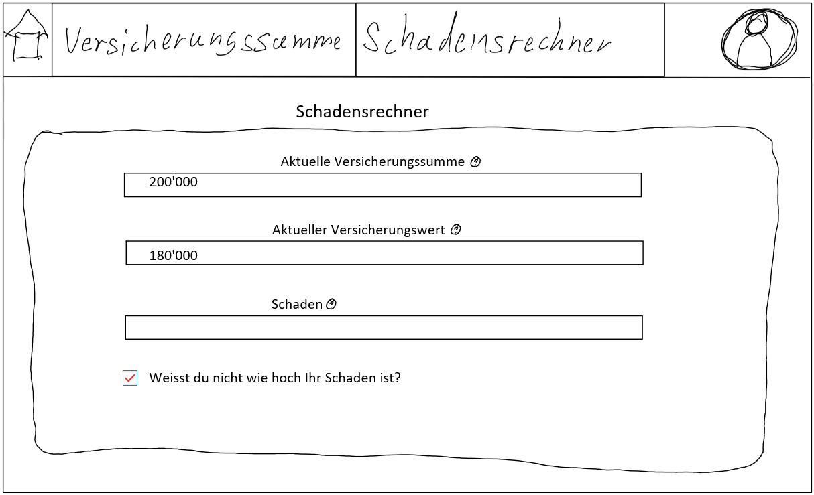
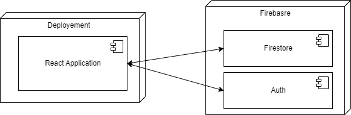

## Idee

Es soll möglich sein seinen gesamten Hausrat zu erfassen um sich dann die optimale Versicherungssumme ausgeben zu lassen.
Dabei sollen zwei Verfahren zum tragen kommen um den Gesamtwert zu errechnen, einmal das Quadratmetermodell, bei welchem die
Quadratmeter des Wohnraums mit einer Pauschale multipliziert werden und das Versicherungsmodell in welchem anhand von Durchschnittswerten abgeschätzt wird wie viel die einzelnen Einrichtungsgegenstände wert sind.
Wenn dieser Gesamtwert nun berechnet ist kann nun mit ein wenig Puffer, damit eine Unterversicherung vermieden werden kann, die Versicherungssumme ausgerechnet werden.
In einem nächsten Schritt kann ein Schaden angegeben werden, Beispielsweise ein Wasser oder Brand Schaden. Dann wird anhand der vorherigen Angaben die Schadenssumme und somit auch der Betrag den die Vericherung zahlt berechnet und ausgegeben.

## Problem Statement

| Kunden/Nutzer                                                          | Probleme                                                                                                                                          | Lösungsansätze                                                                                                                                                                                                                              | Metriken                                                                                                                                                                | Stakeholder                                                      | Randbedingungen | Risiken                                                            |
| ---------------------------------------------------------------------- | ------------------------------------------------------------------------------------------------------------------------------------------------- | --------------------------------------------------------------------------------------------------------------------------------------------------------------------------------------------------------------------------------------------- | ----------------------------------------------------------------------------------------------------------------------------------------------------------------------- | ---------------------------------------------------------------- | --------------- | ------------------------------------------------------------------ |
| Menschen die eine Versicherung abschliessen möchten                   | Haben keine Ahnung von Versicherungen, haben wenig Geld                                                                                           | Spiel welches Hausratsversicherungen erklärt, Formulare aus denen eine optimale Versicherungssumme berechnet werden kann                                                                                                                     | Mindestens 5 Personen bestätigen die Verständlichkeit des Spiels, Mindestens 5 Vorschläge einer Versicherungssumme                                                   | Testpersonen, Datenschutzbehörden                               | ?               | Nicht alle Menschen finden Spiele als Erklärung gut               |
| Menschen die eine Versicherung haben                                   | Wissen nicht wie viel ihr Hausrat effektiv Wert ist, wissen nicht wie viel Prozent bei einem effektiven Schaden gedeckt ist, sind unterversichert | Tabelle von Gegenständen mit durchschnittlichen Preisen mit welchen der Versicherungswert berechnet werden kann, Berechnung des Versicherungswerts anhand des Quadratmetermodells, Grafiken die verschiedene Schadensfallszenarien aufzeigen | Mindestens 50 Preise von Gegenständen, Mindestens für 5 grössere Städte Quadratmeterpreise, Mindestens 3 Szenarien mit den angegeben Daten modellieren und ausgeben | Anbieter der Gegenstände, oder Immobilien, Datenschutzbehörden | ?               | Die Durchschnittspreise könnten nicht akkurat sein                |
| Menschen die wissen möchten, ob es sich lohnt ihren Schaden zu melden | Wissen nicht wie viel des Schaden von der Versicherung gedeckt wird                                                                               | Grafiken die verschiedene Schadensfallszenarien aufzeigen, je nach Versicherungssituation Versicherungssumme neu berechnen                                                                                                                    | Mindestens 3 Szenarien mit den Angegebenen Daten modellieren und ausgeben, Mindestens 5 Vorschläge einer Versicherungssumme                                            | Datenschutzbehörden                                             |                 | Die Schadenszenarien könnten von der Realität sehr weit weg sein |

## User Story

Der User ruft die Seite auf. Er kommt zunächst auf eine Landingpage auf welcher zwischen verschiedenen Möglichkeiten auswählen kann, einmal die Berechnung einer Versicherungssumme, dann den Schadensrechner und auch ein Informationsspiel über Hausratsversicherungen. Er wählt den Schadensrechner zunächst muss er verschiedene Informationen zu seiner Versicherung ausfüllen, die Versicherungssumme, den Versicherungswert und die höhe des Schadens. Die höhe des Schadens kann er entweder als konkrete Zahl eingeben oder aus einer hinterlegten Tabelle zu verschiedenen Durchschnittswerte verschiedener Gegenstände auswählen. Falls dies auch nicht funktioniert, da nicht alle Gegenstände in der Tabelle aufgelistet sind, gibt es dann noch die Möglichkeit die Quadratmeter die vom Schaden betroffen sind anzugeben. Bei erfolgter Erfassung aller notwendigen Daten klickt der User auf berechnen. Eine Grafik wird eingeblendet in welcher zu erkennen ist zu wie viel Prozent er versichert ist und wie hoch die Versicherungssumme sein müsste um eine optimale Schadensdeckung zu erreichen. Er kann sich diese Aufstellung auch als PDF ausgeben lassen.

## Key Screens

#### Landing Page

#### Schadensrechner Screen 1

#### Schadensrechner Screen 2

## Systemdiagramm

